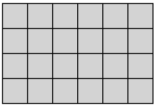
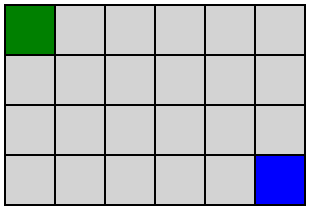
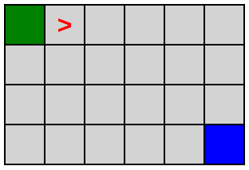
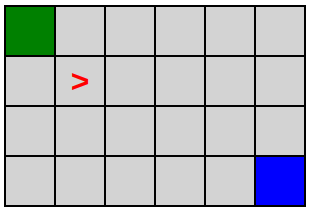

# DecompOser

Tu te rappelles de cette présentation en saison 2 ?

Dans cet exercice, on devoir coder le programme qui va lire les instructions et ensuite déplacer l'élément rouge.  
Autrement, tu vas coder un **interpréteur** d'un langage de programmation très simple, qui ne comprend que **3 instructions** :
- turn left
- turn right
- move forward

## Etapes

### 1 - Board :surfer: :snowboarder:

#### 1.1 - Board simple

Grille du tableau

#### 1.2 - Cases de départ et d'arrivée

#### 1.3 - Curseur / élément rouge

## 2 - Commandes :video_game:

### 2.1 - Avancer

### 2.2 - Touner à droite

### 2.3 - Touner à gauche

